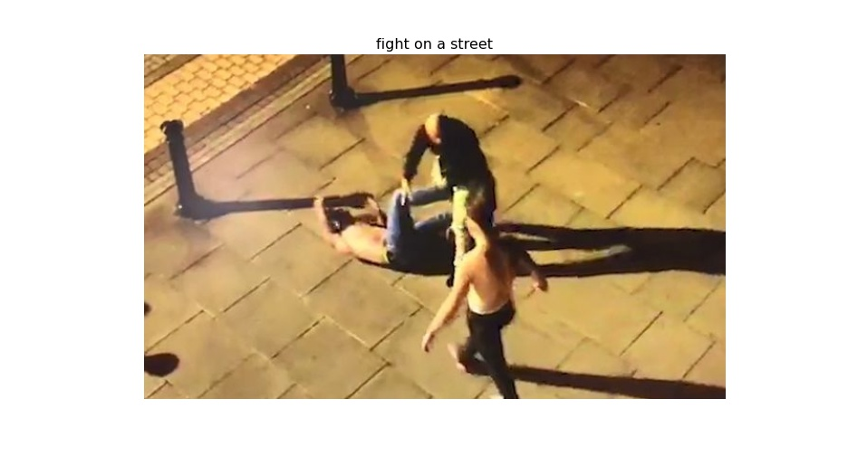
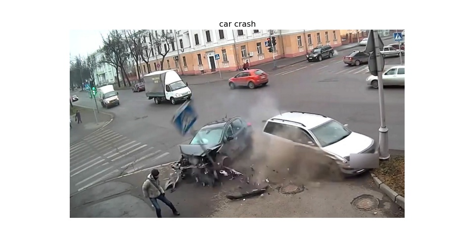
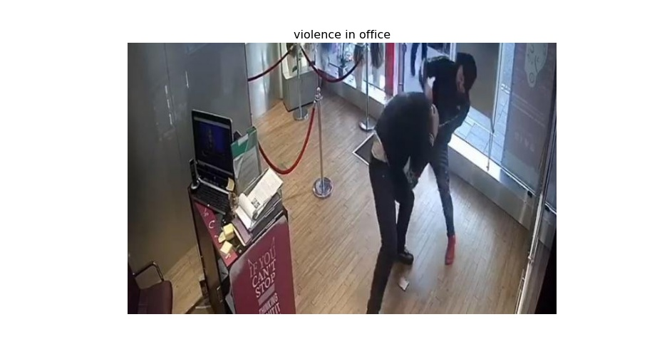
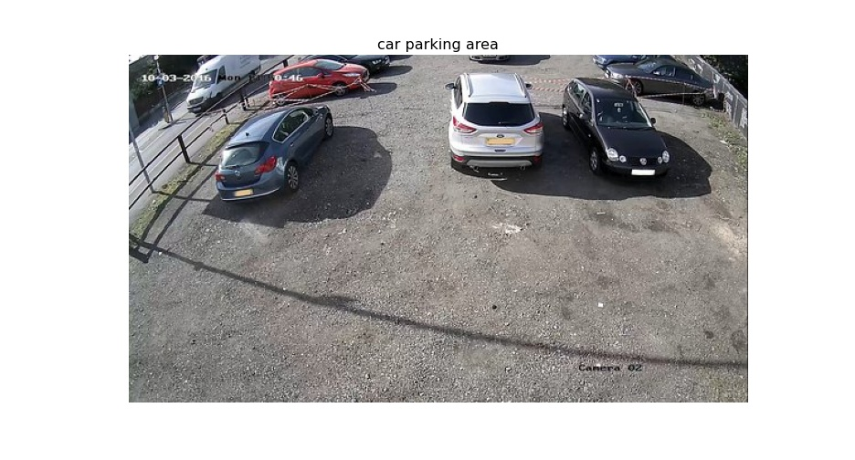
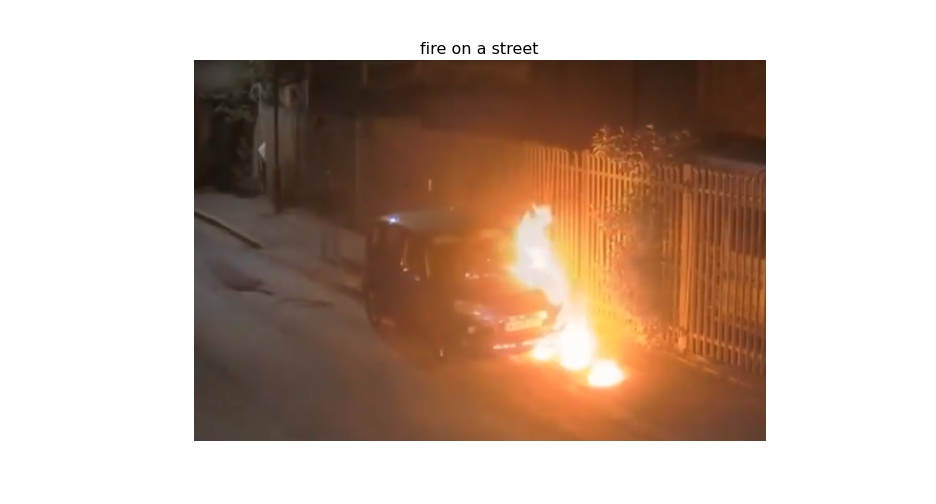
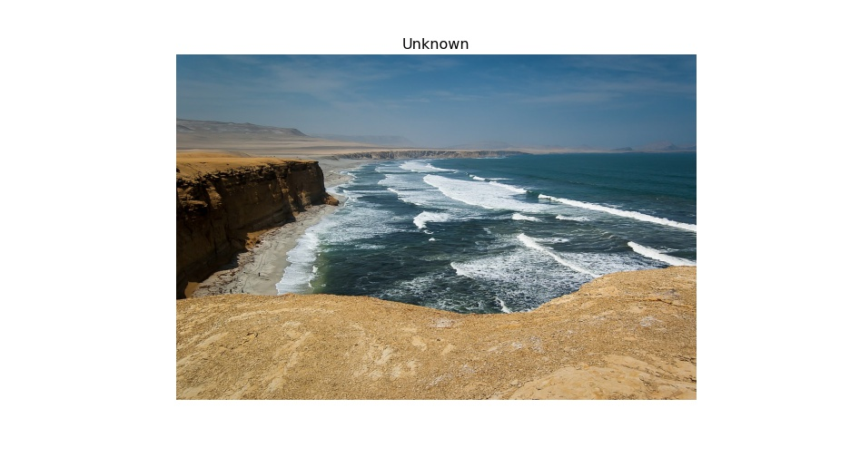

# Table of Contents

[Introduction](#introduction)

[How to Run](#howtorun)

[Resutls](#results)

[Further Work](#work)
<a name="introduction"/>

# Introduction

This repo presents code for Deep Learning based algorithm for
**detecting violence** in indoor or outdoor environments. The algorithm can
detect following scenarios with high accuracy: fight, fire, car crash and even
more.

To detect other scenarios you have to add **descriptive text label** of a
scenario in `settings.yaml` file under `labels` key. At this moment model can
detect 16`+1` scenarios, where one is default `Unknown` label. You can change,
add or remove labels according to your use case. The model is trained on wide
variety of data and can generalize well on other scenarios too.
<a name="howtorun"/>

# How to Run
First install requirements:
`pip install -r requirements.txt`

To test the model you can either run:
`python run.py --image-path ./data/7.jpg`

Or you can test it through web app:
`streamlit run app.py`

Or you can see the example code in `tutorial.ipynb` jupyter notebook

Or incorporate this model in your project using this code:

```python
from model import Model
import cv2

model = Model()
image = cv2.imread('./your_image.jpg')
image = cv2.cvtColor(image, cv2.COLOR_BGR2RGB)
label = model.predict(image=image)['label']
print('Image label is: ', label)
```

<a name="results"></a>
# Results

Below are result videos and images. I used model to make predictions on each 
frame of the videos and print model's predictions on the left side of frame of 
saved videos. In case of images, titles are model's predictions. 
You can find code that produces that result in `tutorial.ipynb` jupyter notebook.


### Result Images










<a name="work"></a>
# Further Work

For further enhancements like: Batch processing support for speedup, return of 
multiple suggestions, threshold fine-tuning for specific data, ect. contact me:

My Linkedin: [Soso Sukhitashvili](https://www.linkedin.com/in/soso-sukhitashvili/)

